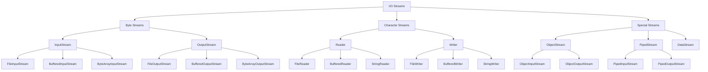

# I/O 스트림

## 1. 개요

### 1.1 I/O 스트림의 필요성

- **파일 처리**: 로컬 파일 시스템의 데이터 읽기/쓰기
- **네트워크 통신**: 원격 시스템과의 데이터 교환
- **프로세스 간 통신**: 서로 다른 프로세스 간 데이터 전송
- **메모리 데이터 처리**: 메모리 내 데이터 스트림 처리

### 1.2 주요 특징

1. **단방향성**
    - 입력 스트림과 출력 스트림의 분리
    - 데이터 흐름의 명확한 방향성
2. **FIFO(First In First Out)**
    - 데이터의 순차적 처리
    - 입력 순서대로 출력 보장
3. **버퍼링 지원**
    - 성능 향상을 위한 버퍼 사용
    - 메모리 효율성 개선
4. **동기/비동기 처리**
    - 동기: 순차적 처리 보장
    - 비동기: 병렬 처리 지원
5. **블로킹/논블로킹 모드**
    - 블로킹: I/O 작업 완료까지 대기
    - 논블로킹: 다른 작업 수행 가능

### 1.3 기본 개념 예제

```java
/**
 * I/O 스트림의 핵심 개념 예제
 */
public class IOStreamConcepts {
    public void demonstrateBasicConcepts() throws IOException {
        // 1. 바이트 기반 스트림
        try (InputStream is = new FileInputStream("input.dat");
             OutputStream os = new FileOutputStream("output.dat")) {
            byte[] buffer = new byte[8192];
            int bytesRead;
            while ((bytesRead = is.read(buffer)) != -1) {
                os.write(buffer, 0, bytesRead);
            }
        }

        // 2. 문자 기반 스트림
        try (Reader reader = new FileReader("input.txt", StandardCharsets.UTF_8);
             Writer writer = new FileWriter("output.txt", StandardCharsets.UTF_8)) {
            char[] buffer = new char[2048];
            int charsRead;
            while ((charsRead = reader.read(buffer)) != -1) {
                writer.write(buffer, 0, charsRead);
            }
        }

        // 3. 버퍼링된 스트림
        try (BufferedReader br = new BufferedReader(
                new FileReader("input.txt", StandardCharsets.UTF_8))) {
            String line;
            while ((line = br.readLine()) != null) {
                System.out.println(line);
            }
        }
    }
}

```

### 1.4 장단점

**장점:**

- 일관된 데이터 처리 인터페이스
- 다양한 데이터 소스/목적지 지원
- 효율적인 메모리 사용
- 확장성과 유연성

**단점:**

- 리소스 관리 필요
- 예외 처리 복잡성
- 성능 오버헤드 가능성
- 메모리 누수 위험

## 2. 스트림 계층 구조

### 2.1 전체 계층도



### 2.2 주요 클래스 설명

### 2.2.1 바이트 스트림 계열

1. **InputStream**
    - 바이트 단위 읽기의 추상 클래스
    - `read()`: 기본 읽기 메서드
    - `close()`: 리소스 해제
2. **OutputStream**
    - 바이트 단위 쓰기의 추상 클래스
    - `write()`: 기본 쓰기 메서드
    - `flush()`: 버퍼 강제 출력

### 2.2.2 문자 스트림 계열

1. **Reader**
    - 문자 단위 읽기의 추상 클래스
    - 인코딩 지원
    - 문자열 처리에 최적화
2. **Writer**
    - 문자 단위 쓰기의 추상 클래스
    - 인코딩 변환 지원
    - 텍스트 처리에 특화

### 2.3 스트림 선택 가이드

```java
public class StreamSelectionGuide {
    public void demonstrateStreamSelection() throws IOException {
        // 1. 바이너리 데이터 처리
        try (FileInputStream fis = new FileInputStream("image.jpg")) {
            // 이미지, 압축 파일 등 바이너리 데이터 처리
        }

        // 2. 텍스트 데이터 처리
        try (BufferedReader reader = new BufferedReader(
                new FileReader("text.txt", StandardCharsets.UTF_8))) {
            // 텍스트 파일 처리
        }

        // 3. 객체 직렬화
        try (ObjectOutputStream oos = new ObjectOutputStream(
                new FileOutputStream("object.dat"))) {
            // 객체 저장
        }

        // 4. 네트워크 통신
        try (Socket socket = new Socket("localhost", 8080);
             BufferedReader reader = new BufferedReader(
                 new InputStreamReader(socket.getInputStream()));
             PrintWriter writer = new PrintWriter(socket.getOutputStream(), true)) {
            // 네트워크 통신
        }
    }
}

```

## 3. 기본 스트림 종류와 특징

### 3.1 바이트 스트림

```java
public class ByteStreamExample {
    public void byteStreamDemo() throws IOException {
        // 기본 바이트 스트림
        try (FileInputStream fis = new FileInputStream("input.bin");
             FileOutputStream fos = new FileOutputStream("output.bin")) {

            // 버퍼 사용 최적화
            byte[] buffer = new byte[8192];
            int bytesRead;
            long totalBytes = 0;

            while ((bytesRead = fis.read(buffer)) != -1) {
                fos.write(buffer, 0, bytesRead);
                totalBytes += bytesRead;
            }

            System.out.printf("Total bytes transferred: %d%n", totalBytes);
        }
    }

    // 성능 최적화된 복사 메서드
    public void optimizedCopy(File source, File destination) throws IOException {
        try (FileChannel sourceChannel = new FileInputStream(source).getChannel();
             FileChannel destChannel = new FileOutputStream(destination).getChannel()) {

            sourceChannel.transferTo(0, sourceChannel.size(), destChannel);
        }
    }
}

```

### 3.2 문자 스트림

```java
public class CharacterStreamExample {
    public void characterStreamDemo() throws IOException {
        // 문자 스트림 with 인코딩 지정
        try (Reader reader = new InputStreamReader(
                new FileInputStream("input.txt"), StandardCharsets.UTF_8);
             Writer writer = new OutputStreamWriter(
                new FileOutputStream("output.txt"), StandardCharsets.UTF_8)) {

            char[] buffer = new char[2048];
            int charsRead;
            StringBuilder content = new StringBuilder();

            // 효율적인 문자열 처리
            while ((charsRead = reader.read(buffer)) != -1) {
                content.append(buffer, 0, charsRead);
            }

            // 대용량 텍스트 처리를 위한 청크 단위 쓰기
            int chunkSize = 4096;
            String text = content.toString();
            for (int i = 0; i < text.length(); i += chunkSize) {
                int end = Math.min(i + chunkSize, text.length());
                writer.write(text.substring(i, end));
            }
        }
    }

    // 인코딩 변환 유틸리티
    public void convertEncoding(String source, String target,
                              String sourceEncoding, String targetEncoding)
            throws IOException {
        try (BufferedReader reader = new BufferedReader(
                new InputStreamReader(new FileInputStream(source), sourceEncoding));
             BufferedWriter writer = new BufferedWriter(
                new OutputStreamWriter(new FileOutputStream(target), targetEncoding))) {

            String line;
            while ((line = reader.readLine()) != null) {
                writer.write(line);
                writer.newLine();
            }
        }
    }
}

```

### 3.3 버퍼 스트림

```java
public class BufferedStreamExample {
    private static final int OPTIMAL_BUFFER_SIZE = 8192;

    public void bufferedStreamDemo() throws IOException {
        // 버퍼링된 읽기/쓰기
        try (BufferedReader reader = new BufferedReader(
                new FileReader("input.txt"), OPTIMAL_BUFFER_SIZE);
             BufferedWriter writer = new BufferedWriter(
                new FileWriter("output.txt"), OPTIMAL_BUFFER_SIZE)) {

            String line;
            int lineCount = 0;

            while ((line = reader.readLine()) != null) {
                writer.write(line);
                writer.newLine();
                lineCount++;

                // 주기적인 버퍼 플러시
                if (lineCount % 1000 == 0) {
                    writer.flush();
                }
            }
        }
    }

    // 대용량 파일 처리를 위한 청크 단위 처리
    public void processLargeFile(String filename) throws IOException {
        try (BufferedReader reader = new BufferedReader(
                new FileReader(filename), OPTIMAL_BUFFER_SIZE)) {

            List<String> chunk = new ArrayList<>();
            String line;
            int chunkSize = 0;
            int maxChunkSize = 1024 * 1024; // 1MB

            while ((line = reader.readLine()) != null) {
                chunk.add(line);
                chunkSize += line.length();

                if (chunkSize >= maxChunkSize) {
                    processChunk(chunk);
                    chunk.clear();
                    chunkSize = 0;
                }
            }

            // 마지막 청크 처리
            if (!chunk.isEmpty()) {
                processChunk(chunk);
            }
        }
    }

    private void processChunk(List<String> chunk) {
        // 청크 데이터 처리 로직
    }
}

```

## 4. 고급 버퍼 관리

### 4.1 버퍼 크기 최적화

```java
public class BufferOptimization {
    // 버퍼 크기 상수
    private static final int TINY_BUFFER = 1024;        // 1KB
    private static final int SMALL_BUFFER = 4096;       // 4KB
    private static final int MEDIUM_BUFFER = 8192;      // 8KB
    private static final int LARGE_BUFFER = 16384;      // 16KB
    private static final int HUGE_BUFFER = 32768;       // 32KB

    public void optimizeBufferSize(File file) throws IOException {
        long fileSize = file.length();
        int optimalSize = calculateOptimalBufferSize(fileSize);

        try (BufferedInputStream bis = new BufferedInputStream(
                new FileInputStream(file), optimalSize)) {

            byte[] buffer = new byte[optimalSize];
            int bytesRead;
            long totalBytesRead = 0;
            long startTime = System.nanoTime();

            while ((bytesRead = bis.read(buffer)) != -1) {
                totalBytesRead += bytesRead;
                // 데이터 처리
            }

            long endTime = System.nanoTime();
            double seconds = (endTime - startTime) / 1_000_000_000.0;
            double mbPerSecond = (totalBytesRead / 1024.0 / 1024.0) / seconds;

            System.out.printf("처리 속도: %.2f MB/s%n", mbPerSecond);
        }
    }

    private int calculateOptimalBufferSize(long fileSize) {
        if (fileSize < 100 * 1024) {         // 100KB 미만
            return TINY_BUFFER;
        } else if (fileSize < 1024 * 1024) { // 1MB 미만
            return SMALL_BUFFER;
        } else if (fileSize < 10 * 1024 * 1024) { // 10MB 미만
            return MEDIUM_BUFFER;
        } else if (fileSize < 100 * 1024 * 1024) { // 100MB 미만
            return LARGE_BUFFER;
        } else {
            return HUGE_BUFFER;
        }
    }
}

```

### 4.2 Direct vs Non-Direct 버퍼

```java
public class BufferTypeComparison {
    public void compareBufferTypes() throws IOException {
        // Direct 버퍼 (OS 메모리에 직접 할당)
        ByteBuffer directBuffer = ByteBuffer.allocateDirect(1024 * 1024);

        // Non-Direct 버퍼 (JVM 힙 메모리에 할당)
        ByteBuffer heapBuffer = ByteBuffer.allocate(1024 * 1024);

        // 성능 비교
        Path file = Path.of("large-file.dat");
        FileChannel channel = FileChannel.open(file, StandardOpenOption.READ);

        try {
            // Direct 버퍼 성능 측정
            long directStart = System.nanoTime();
            channel.read(directBuffer);
            long directTime = System.nanoTime() - directStart;

            // Non-Direct 버퍼 성능 측정
            channel.position(0);
            heapBuffer.clear();
            long heapStart = System.nanoTime();
            channel.read(heapBuffer);
            long heapTime = System.nanoTime() - heapStart;

            System.out.printf("Direct Buffer: %d ns%n", directTime);
            System.out.printf("Heap Buffer: %d ns%n", heapTime);
        } finally {
            // 메모리 해제
            if (directBuffer.isDirect()) {
                ((DirectBuffer) directBuffer).cleaner().clean();
            }
            channel.close();
        }
    }

    // 버퍼 타입 선택 가이드
    public ByteBuffer selectAppropriateBuffer(long dataSize, boolean frequentAccess) {
        if (dataSize > 1024 * 1024 && !frequentAccess) {
            // 대용량 데이터, 낮은 접근 빈도 -> Direct 버퍼
            return ByteBuffer.allocateDirect((int) dataSize);
        } else {
            // 소용량 데이터 또는 빈번한 접근 -> Heap 버퍼
            return ByteBuffer.allocate((int) dataSize);
        }
    }

    // Direct 버퍼 사용 가이드라인
    public static class DirectBufferGuidelines {
        private static final int THRESHOLD_SIZE = 4 * 1024 * 1024; // 4MB

        public ByteBuffer selectAppropriateBuffer(int size) {
            if (size >= THRESHOLD_SIZE) {
                // 대용량 데이터의 경우 Direct 버퍼 사용
                return ByteBuffer.allocateDirect(size);
            } else {
                // 소용량 데이터의 경우 힙 버퍼 사용
                return ByteBuffer.allocate(size);
            }
        }
    }
}

```

## 5. 성능 최적화

### 5.1 비동기 I/O 처리

```java
public class AsyncIOExample {
    private final AsynchronousFileChannel channel;
    private final ExecutorService executor;

    public AsyncIOExample(Path path) throws IOException {
        this.channel = AsynchronousFileChannel.open(path);
        this.executor = Executors.newFixedThreadPool(
            Runtime.getRuntime().availableProcessors()
        );
    }

    public CompletableFuture<ByteBuffer> readAsync(long position, int size) {
        ByteBuffer buffer = ByteBuffer.allocate(size);
        CompletableFuture<ByteBuffer> future = new CompletableFuture<>();

        channel.read(buffer, position, buffer, new CompletionHandler<Integer, ByteBuffer>() {
            @Override
            public void completed(Integer result, ByteBuffer attachment) {
                attachment.flip();
                future.complete(attachment);
            }

            @Override
            public void failed(Throwable exc, ByteBuffer attachment) {
                future.completeExceptionally(exc);
            }
        });

        return future;
    }

    public void shutdown() throws IOException {
        channel.close();
        executor.shutdown();
    }
}

```

### 5.2 메모리 매핑 파일

```java
public class MemoryMappedFileExample {
    public void processLargeFile(Path path) throws IOException {
        try (FileChannel channel = FileChannel.open(path,
                StandardOpenOption.READ, StandardOpenOption.WRITE)) {

            long fileSize = channel.size();
            long mappingSize = Math.min(fileSize, Integer.MAX_VALUE);

            MappedByteBuffer buffer = channel.map(
                FileChannel.MapMode.READ_WRITE, 0, mappingSize);

            // 메모리에 매핑된 파일 처리
            while (buffer.hasRemaining()) {
                // 데이터 처리
                byte value = buffer.get();
                buffer.put(buffer.position() - 1, (byte)(value + 1));
            }

            // 변경사항 강제 동기화
            buffer.force();
        }
    }

    // 대용량 파일의 청크 단위 처리
    public void processLargeFileInChunks(Path path) throws IOException {
        try (FileChannel channel = FileChannel.open(path)) {
            long fileSize = channel.size();
            long chunkSize = 1024 * 1024 * 1024L; // 1GB 청크

            for (long position = 0; position < fileSize; position += chunkSize) {
                long remainingSize = fileSize - position;
                long currentChunkSize = Math.min(chunkSize, remainingSize);

                MappedByteBuffer buffer = channel.map(
                    FileChannel.MapMode.READ_ONLY, position, currentChunkSize);

                processChunk(buffer);
            }
        }
    }

    private void processChunk(MappedByteBuffer buffer) {
        // 청크 데이터 처리 로직
    }
}

```

### 5.3 성능 모니터링

```java
public class IOPerformanceMonitor {
    private static final int SAMPLE_INTERVAL = 1000; // 1초

    public void monitorIOPerformance(InputStream is, OutputStream os) {
        long startTime = System.nanoTime();
        long bytesTransferred = 0;
        long lastSampleTime = startTime;
        long lastBytesTransferred = 0;

        try {
            byte[] buffer = new byte[8192];
            int bytesRead;

            while ((bytesRead = is.read(buffer)) != -1) {
                os.write(buffer, 0, bytesRead);
                bytesTransferred += bytesRead;

                // 주기적인 성능 측정
                long currentTime = System.nanoTime();
                if (currentTime - lastSampleTime >= SAMPLE_INTERVAL * 1_000_000) {
                    double seconds = (currentTime - lastSampleTime) / 1_000_000_000.0;
                    double throughput = (bytesTransferred - lastBytesTransferred) / seconds / 1024 / 1024;

                    System.out.printf("처리량: %.2f MB/s%n", throughput);

                    lastSampleTime = currentTime;
                    lastBytesTransferred = bytesTransferred;
                }
            }
        } catch (IOException e) {
            e.printStackTrace();
        }
    }

    // 리소스 사용량 모니터링
    public void monitorResourceUsage() {
        OperatingSystemMXBean osBean = ManagementFactory.getOperatingSystemMXBean();
        ThreadMXBean threadBean = ManagementFactory.getThreadMXBean();

        if (osBean instanceof com.sun.management.OperatingSystemMXBean) {
            com.sun.management.OperatingSystemMXBean sunOsBean =
                (com.sun.management.OperatingSystemMXBean) osBean;

            System.out.printf("CPU 사용량: %.2f%%%n",
                sunOsBean.getProcessCpuLoad() * 100);
            System.out.printf("시스템 부하: %.2f%n",
                sunOsBean.getSystemLoadAverage());
            System.out.printf("사용 가능한 메모리: %d MB%n",
                sunOsBean.getFreePhysicalMemorySize() / 1024 / 1024);
        }

        System.out.printf("활성 스레드 수: %d%n",
            threadBean.getThreadCount());
    }
}

```

## 6. 보안 강화

### 6.1 안전한 파일 처리

```java
public class SecureFileHandler {
    private static final String TEMP_DIR = System.getProperty("java.io.tmpdir");

    public void secureFileProcessing(Path input) throws IOException {
        // 임시 파일 생성
        Path tempFile = Files.createTempFile(
            Paths.get(TEMP_DIR), "secure", ".tmp");

        try {
            // 파일 권한 설정
            Set<PosixFilePermission> perms =
                PosixFilePermissions.fromString("rw-------");
            Files.setPosixFilePermissions(tempFile, perms);

            // 안전한 파일 복사
            Files.copy(input, tempFile,
                StandardCopyOption.REPLACE_EXISTING);

            // 파일 처리
            processSecureFile(tempFile);

        } finally {
            // 임시 파일 안전하게 삭제
            Files.deleteIfExists(tempFile);
        }
    }

    private void processSecureFile(Path path) throws IOException {
        // 보안 처리 로직
    }
}

```

### 6.2 암호화 스트림

```java
public class EncryptedStreamHandler {
    private static final String ALGORITHM = "AES/CBC/PKCS5Padding";
    private static final int KEY_SIZE = 256;

    private final SecretKey secretKey;
    private final IvParameterSpec iv;

    public EncryptedStreamHandler() throws NoSuchAlgorithmException {
        // 키 생성
        KeyGenerator keyGen = KeyGenerator.getInstance("AES");
        keyGen.init(KEY_SIZE);
        this.secretKey = keyGen.generateKey();

        // IV(Initial Vector) 생성
        byte[] ivBytes = new byte[16];
        SecureRandom.getInstanceStrong().nextBytes(ivBytes);
        this.iv = new IvParameterSpec(ivBytes);
    }

    public void encryptFile(String inputFile, String outputFile)
            throws GeneralSecurityException, IOException {
        Cipher cipher = Cipher.getInstance(ALGORITHM);
        cipher.init(Cipher.ENCRYPT_MODE, secretKey, iv);

        try (FileInputStream fis = new FileInputStream(inputFile);
             FileOutputStream fos = new FileOutputStream(outputFile);
             CipherOutputStream cos = new CipherOutputStream(fos, cipher)) {

            byte[] buffer = new byte[8192];
            int count;
            while ((count = fis.read(buffer)) != -1) {
                cos.write(buffer, 0, count);
            }
        }
    }

    public void decryptFile(String inputFile, String outputFile)
            throws GeneralSecurityException, IOException {
        Cipher cipher = Cipher.getInstance(ALGORITHM);
        cipher.init(Cipher.DECRYPT_MODE, secretKey, iv);

        try (FileInputStream fis = new FileInputStream(inputFile);
             CipherInputStream cis = new CipherInputStream(fis, cipher);
             FileOutputStream fos = new FileOutputStream(outputFile)) {

            byte[] buffer = new byte[8192];
            int count;
            while ((count = cis.read(buffer)) != -1) {
                fos.write(buffer, 0, count);
            }
        }
    }
}

```

## 7. 리소스 관리와 예외 처리

### 7.1 자동 리소스 관리

```java
public class ResourceManagement {
    public static class CustomResource implements AutoCloseable {
        private final String name;
        private boolean isClosed = false;

        public CustomResource(String name) {
            this.name = name;
            System.out.println(name + " 리소스가 생성되었습니다.");
        }

        public void process() throws IOException {
            if (isClosed) {
                throw new IllegalStateException("리소스가 이미 닫혔습니다.");
            }
            System.out.println(name + " 리소스를 처리 중입니다.");
        }

        @Override
        public void close() throws Exception {
            if (!isClosed) {
                System.out.println(name + " 리소스를 정리합니다.");
                isClosed = true;
            }
        }
    }

    public void demonstrateResourceManagement() {
        try (CustomResource res1 = new CustomResource("Database");
             CustomResource res2 = new CustomResource("Network");
             CustomResource res3 = new CustomResource("File")) {

            res1.process();
            res2.process();
            res3.process();

        } catch (Exception e) {
            e.printStackTrace();
        }
    }
}

```

### 7.2 고급 예외 처리

```java
public class AdvancedExceptionHandling {
    public void processWithRetry(String filename, int maxRetries) {
        int attempts = 0;
        long waitTime = 1000; // 초기 대기 시간 1초

        while (attempts < maxRetries) {
            try {
                processFile(filename);
                return; // 성공하면 종료
            } catch (IOException e) {
                attempts++;
                if (attempts == maxRetries) {
                    throw new RuntimeException("최대 재시도 횟수 초과", e);
                }

                // 지수 백오프
                waitTime *= 2;
                try {
                    Thread.sleep(waitTime);
                } catch (InterruptedException ie) {
                    Thread.currentThread().interrupt();
                    throw new RuntimeException("처리가 중단되었습니다.", ie);
                }
            }
        }
    }

    private void processFile(String filename) throws IOException {
        try (FileInputStream fis = new FileInputStream(filename)) {
            // 파일 처리 로직
        } catch (FileNotFoundException e) {
            throw new IOException("파일을 찾을 수 없습니다: " + filename, e);
        } catch (SecurityException e) {
            throw new IOException("파일 접근 권한이 없습니다: " + filename, e);
        }
    }

    // 체인 예외 처리
    public class ChainedExceptionHandler {
        public void handleChainedException() {
            try {
                try {
                    throw new IOException("원본 예외");
                } catch (IOException e) {
                    throw new RuntimeException("래핑된 예외", e);
                }
            } catch (RuntimeException e) {
                Throwable cause = e.getCause();
                System.out.println("원인 예외: " + cause.getMessage());
                System.out.println("스택 트레이스:");
                e.printStackTrace();
            }
        }
    }
}

```

## 8. 실전 응용 예제

### 8.1 파일 복사 유틸리티

```java
public class FileCopyUtility {
    private static final int DEFAULT_BUFFER_SIZE = 8192;
    private final Path source;
    private final Path target;
    private long totalBytes;
    private long copiedBytes;
    private ProgressCallback callback;

    public interface ProgressCallback {
        void onProgress(double progress, long speed);
    }

    public FileCopyUtility(Path source, Path target) {
        this.source = source;
        this.target = target;
    }

    public void setProgressCallback(ProgressCallback callback) {
        this.callback = callback;
    }

    public void copy() throws IOException {
        totalBytes = Files.size(source);
        copiedBytes = 0;
        long startTime = System.nanoTime();

        try (FileChannel sourceChannel = FileChannel.open(source, StandardOpenOption.READ);
             FileChannel targetChannel = FileChannel.open(target,
                 StandardOpenOption.CREATE,
                 StandardOpenOption.WRITE)) {

            long position = 0;
            long count = DEFAULT_BUFFER_SIZE;
            long lastUpdate = System.nanoTime();
            long lastBytes = 0;

            while (position < totalBytes) {
                long transferred = sourceChannel.transferTo(
                    position, count, targetChannel);

                if (transferred > 0) {
                    position += transferred;
                    copiedBytes += transferred;

                    // 진행률 업데이트
                    if (callback != null &&
                        System.nanoTime() - lastUpdate > 1_000_000_000) { // 1초

                        double progress = (double) copiedBytes / totalBytes;
                        long speed = (copiedBytes - lastBytes);
                        callback.onProgress(progress, speed);

                        lastUpdate = System.nanoTime();
                        lastBytes = copiedBytes;
                    }
                }
            }
        }
    }
}

```

### 8.2 로그 파일 분석기

```java
public class LogFileAnalyzer {
    private final Path logFile;
    private final Pattern logPattern;
    private final Map<String, Integer> errorCount = new ConcurrentHashMap<>();
    private final Map<String, List<String>> errorDetails = new ConcurrentHashMap<>();

    public LogFileAnalyzer(Path logFile) {
        this.logFile = logFile;
        this.logPattern = Pattern.compile(
            "\\\\[(ERROR|WARN|INFO)\\\\]\\\\s+(\\\\d{4}-\\\\d{2}-\\\\d{2})\\\\s+(.*)");
    }

    public void analyze() throws IOException {
        try (Stream<String> lines = Files.lines(logFile)) {
            lines.parallel()
                 .filter(line -> !line.trim().isEmpty())
                 .forEach(this::processLine);
        }
    }

    private void processLine(String line) {
        Matcher matcher = logPattern.matcher(line);
        if (matcher.matches()) {
            String level = matcher.group(1);
            String date = matcher.group(2);
            String message = matcher.group(3);

            if ("ERROR".equals(level)) {
                errorCount.merge(date, 1, Integer::sum);
                errorDetails.computeIfAbsent(date, k -> new ArrayList<>())
                          .add(message);
            }
        }
    }

    public void generateReport(Path outputFile) throws IOException {
        try (BufferedWriter writer = Files.newBufferedWriter(outputFile)) {
            writer.write("로그 분석 리포트\\n");
            writer.write("=================\\n\\n");

            writer.write("일별 에러 발생 횟수:\\n");
            errorCount.entrySet().stream()
                     .sorted(Map.Entry.comparingByKey())
                     .forEach(entry -> {
                try {
                    writer.write(String.format("%s: %d회\\n",
                        entry.getKey(), entry.getValue()));
                } catch (IOException e) {
                    throw new UncheckedIOException(e);
                }
            });

            writer.write("\\n상세 에러 메시지:\\n");
            errorDetails.forEach((date, messages) -> {
                try {
                    writer.write("\\n" + date + ":\\n");
                    for (String msg : messages) {
                        writer.write("  - " + msg + "\\n");
                    }
                } catch (IOException e) {
                    throw new UncheckedIOException(e);
                }
            });
        }
    }
}

```

## 9. 모범 사례와 주의사항

### 9.1 성능 최적화 가이드라인

```java
public class StreamBestPractices {
    // 버퍼 크기 상수
    private static final int BUFFER_SIZE = 8192;
    private static final int MAX_ARRAY_SIZE = Integer.MAX_VALUE - 8;

    public class OptimizedStreamOperations {
        // 대용량 파일 처리를 위한 최적화된 방법
        public void processLargeFile(Path source, Path target) throws IOException {
            // 1. NIO 채널 사용
            try (FileChannel sourceChannel = FileChannel.open(source);
                 FileChannel targetChannel = FileChannel.open(target,
                     StandardOpenOption.CREATE,
                     StandardOpenOption.WRITE)) {

                // 2. 직접 버퍼 사용
                ByteBuffer buffer = ByteBuffer.allocateDirect(BUFFER_SIZE);

                while (sourceChannel.read(buffer) != -1) {
                    buffer.flip();
                    while (buffer.hasRemaining()) {
                        targetChannel.write(buffer);
                    }
                    buffer.clear();
                }
            }
        }

        // 메모리 효율적인 텍스트 처리
        public void processTextEfficiently(Reader reader, Writer writer)
                throws IOException {
            char[] buffer = new char[BUFFER_SIZE];
            int charsRead;

            // 3. 버퍼 재사용
            while ((charsRead = reader.read(buffer)) != -1) {
                writer.write(buffer, 0, charsRead);
            }
        }
    }

    // 리소스 관리 모범 사례
    public class ResourceManagementExample {
        public void demonstrateProperResourceHandling() {
            // 4. try-with-resources 사용
            try (FileInputStream fis = new FileInputStream("input.txt");
                 BufferedInputStream bis = new BufferedInputStream(fis);
                 FileOutputStream fos = new FileOutputStream("output.txt");
                 BufferedOutputStream bos = new BufferedOutputStream(fos)) {

                byte[] buffer = new byte[BUFFER_SIZE];
                int bytesRead;

                while ((bytesRead = bis.read(buffer)) != -1) {
                    bos.write(buffer, 0, bytesRead);
                }

                // 5. 명시적 flush
                bos.flush();
            } catch (IOException e) {
                // 6. 적절한 예외 처리
                logger.error("파일 처리 중 오류 발생", e);
                throw new RuntimeException("파일 처리 실패", e);
            }
        }
    }
}

```

### 9.2 주의사항 및 안티패턴

```java
public class StreamAntiPatterns {
    // 안티패턴 1: 리소스 누수
    public void resourceLeakExample() {
        FileInputStream fis = null;
        try {
            fis = new FileInputStream("file.txt");
            // 처리 로직
        } catch (IOException e) {
            e.printStackTrace();
        }
        // 잘못된 예: close()가 호출되지 않음
    }

    // 올바른 방법
    public void properResourceHandling() {
        try (FileInputStream fis = new FileInputStream("file.txt")) {
            // 처리 로직
        } catch (IOException e) {
            logger.error("파일 처리 실패", e);
        }
    }

    // 안티패턴 2: 불필요한 버퍼링
    public void unnecessaryBuffering() {
        try (BufferedReader reader = new BufferedReader(
                new BufferedReader(
                    new BufferedReader(
                        new FileReader("file.txt"))))) {
            // 중복된 버퍼링
        } catch (IOException e) {
            e.printStackTrace();
        }
    }

    // 올바른 방법
    public void properBuffering() {
        try (BufferedReader reader = new BufferedReader(
                new FileReader("file.txt"))) {
            // 단일 버퍼 사용
        } catch (IOException e) {
            logger.error("파일 읽기 실패", e);
        }
    }
}

```

### 9.3 체크리스트 및 권장사항

```java
public class StreamBestPracticesChecklist {
    public class PerformanceChecklist {
        // 1. 버퍼 크기 최적화
        private static final int OPTIMAL_BUFFER_SIZE = 8192;

        // 2. 리소스 모니터링
        private final MemoryMXBean memoryBean = ManagementFactory.getMemoryMXBean();

        public void monitorResourceUsage() {
            MemoryUsage heapUsage = memoryBean.getHeapMemoryUsage();
            long usedMemory = heapUsage.getUsed();
            long maxMemory = heapUsage.getMax();

            // 메모리 사용량이 80%를 초과하면 경고
            if ((double) usedMemory / maxMemory > 0.8) {
                logger.warn("높은 메모리 사용량 감지: {}%",
                    (usedMemory * 100 / maxMemory));
            }
        }
    }

    public class SecurityChecklist {
        // 3. 보안 체크리스트
        private void securityChecks(Path file) throws IOException {
            // 파일 존재 여부 확인
            if (!Files.exists(file)) {
                throw new FileNotFoundException("파일이 존재하지 않습니다");
            }

            // 파일 권한 확인
            if (!Files.isReadable(file)) {
                throw new SecurityException("파일 읽기 권한이 없습니다");
            }

            // 심볼릭 링크 확인
            if (Files.isSymbolicLink(file)) {
                logger.warn("심볼릭 링크 감지: {}", file);
            }

            // 파일 크기 제한 확인
            if (Files.size(file) > MAX_FILE_SIZE) {
                throw new IOException("파일 크기가 제한을 초과합니다");
            }
        }
    }

    public class MaintenanceChecklist {
        // 4. 유지보수 체크리스트
        public void maintenanceChecks() {
            // 임시 파일 정리
            cleanupTempFiles();

            // 로그 로테이션
            rotateLogFiles();

            // 리소스 모니터링
            monitorSystemResources();
        }

        private void cleanupTempFiles() {
            try {
                Path tempDir = Paths.get(System.getProperty("java.io.tmpdir"));
                Files.walk(tempDir)
                     .filter(p -> p.toString().endsWith(".tmp"))
                     .filter(p -> isOldFile(p))
                     .forEach(this::safeDelete);
            } catch (IOException e) {
                logger.error("임시 파일 정리 실패", e);
            }
        }

        private boolean isOldFile(Path file) {
            try {
                FileTime creationTime = Files.getLastModifiedTime(file);
                return ChronoUnit.DAYS.between(
                    creationTime.toInstant(),
                    Instant.now()) > 7;
            } catch (IOException e) {
                return false;
            }
        }

        private void safeDelete(Path file) {
            try {
                Files.deleteIfExists(file);
            } catch (IOException e) {
                logger.warn("파일 삭제 실패: {}", file, e);
            }
        }
    }
}

```

### 9.4 디버깅 및 문제 해결

```java
public class StreamDebugging {
    private static final Logger logger = LoggerFactory.getLogger(StreamDebugging.class);

    public class StreamDebugger {
        public void debugStream(InputStream is, OutputStream os)
                throws IOException {
            try {
                byte[] buffer = new byte[8192];
                int bytesRead;
                long totalBytes = 0;
                long startTime = System.nanoTime();

                while ((bytesRead = is.read(buffer)) != -1) {
                    // 데이터 로깅
                    if (logger.isDebugEnabled()) {
                        logger.debug("읽은 바이트: {}, 총 바이트: {}",
                            bytesRead, totalBytes += bytesRead);
                    }

                    os.write(buffer, 0, bytesRead);

                    // 성능 모니터링
                    if (totalBytes % (1024 * 1024) == 0) { // 1MB 마다
                        long elapsedTime = System.nanoTime() - startTime;
                        double mbPerSecond = (totalBytes / 1024.0 / 1024.0) /
                            (elapsedTime / 1_000_000_000.0);
                        logger.info("처리 속도: {:.2f} MB/s", mbPerSecond);
                    }
                }
            } catch (IOException e) {
                logger.error("스트림 처리 중 오류 발생", e);
                throw e;
            }
        }
    }
}

```
